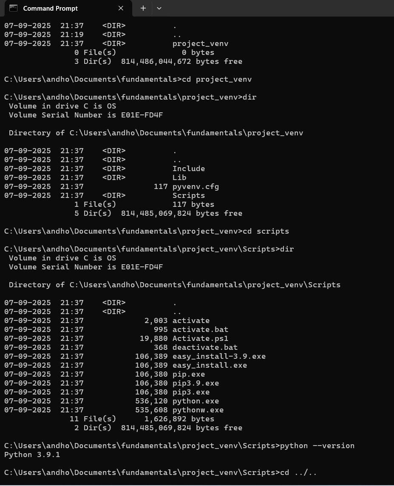

# Python
created by `Guido van Rossumin` in 1989

was named after the British comedy group `Monty Python` (who says developers don't have a sense of humour!)

## what is python?

Python	is	a	language,	not	an	application.

there	are	many	implementations of	Python

 CPython - Canonical pthon

 PyPy

### 🧠 Python vs. CPython
- `Python`: This is the language specification—it defines the syntax, semantics, and core behavior of the language. Think of it like the blueprint.
- `CPython`: This is the default and most widely used implementation of that blueprint. It's written in C and is what you download from `python.org`.

So when you write Python code and run it using the standard interpreter, you're almost certainly using CPython

## Python Compilers that translate python to other languages

`IronPython`: Python → .NET 

`Jython`: Python → Java 

`Cython`: Python → C/C++ 

### 🧠 What Does "Backward Compatible" Mean?

It means that code written for an older version of a language should still run correctly on newer versions without modification. Python tries to maintain this within major versions (like 3.7 → 3.8 → 3.9), but not across major version jumps, especially from Python 2 to Python 3

install above downloaded executable from python.org

different versions of python will be insatlled in different directories

installing CPython is essentially about placing a set of files (including the interpreter and standard library) into a directory on your system.

highlighted one is the python interpreter-> also called as python executable (python, python3, or python.exe)

call the desired python to run the .py files

download desired python version from here

### Interpreter	
Execution ->	Line-by-line	
### Compiler
Execution -> Entire program at once

so python is both compiler and interpreter

### 🧩 Python Execution Flow: Key Steps

the interpreter (python.exe) is the entire engine that orchestrates the process. It includes:

#### Parser & Compiler

Converts your .py source code into bytecode (.pyc files).

This step is handled by the interpreter’s front-end.

#### Python Virtual Machine (PVM)

Executes the bytecode line by line.

This is the back-end of the interpreter.

Add theese paths to environment variables if the command prompt dosen't find python or pip

go the paths where different versions of python executables exists and check thier versions

python by defualt runs the lastest version if you are in another other directory

### C:\Users\andho\AppData\Local\Programs\Python\Python39

This is the actual Python installation directory. It contains:

python.exe — the Python interpreter (executable)

The standard library (modules like os, math, etc.)

Scripts and tools like pip, idle, and venv

Any packages installed system-wide (if not using virtual environments)

This is where base Python/reference python  lives on your system.

### C:\Users\andho\AppData\Roaming\Microsoft\Windows\Start Menu\Programs\Python 3.9

This folder contains shortcuts for launching Python-related tools:

Shortcut to the Python interpreter

Shortcut to IDLE

Shortcut to Python documentation

Possibly links to uninstallers or configuration tools

This is part of your Start Menu structure, not the actual Python installation. It’s designed to make launching Python easier from the Windows UI.

### 🧭 What Is py?
py refers to the Python Launcher, a small utility that helps you manage and run different versions of Python installed on your system.

py is not Python itself, but a launcher that comes bundled with Python installations on Windows.

It lives in C:\Windows\ so it’s accessible from any command prompt without needing to modify your PATH.

Automatically detects all installed Python versions.

Launches the latest version python interactive shell by default when you type: `py`

you can `exit()` from interactive mode

## Virtual Environments 

### PROBLEM 1

so, what is the solution? do it easily using venv

### PROBLEM 2

### PROBLEM 3

### FINAL SOLUTION

The PATH environment variable tells your operating system where to look for executable files when you type a command in the terminal or command prompt.

When you run:`.venv\Scripts\activate.bat`

It temporarily modifies your PATH environment variable so that:

The virtual environment’s Scripts folder is placed at the front of PATH.

This means when you type python or pip, Windows uses the versions inside .venv, not the system-wide ones.

for one project(fundamentals) you won't be needing multiple venv and you will be working with one python verison or one venv

 

 # PIP

 

 

### Summary
1. download python version(base) you need for your project -has python, pip, py
2. create a project folder somewhere in your system
3. create a virtual environment in that folder and activate it using py or python
4. install, update or delete packages or 3rd party libraries you need using pip
5. save the requirements.txt file

`PyPI` stands for the Python Package Index—it's the official online repository where Python developers publish and share their packages 📦.

`>pip install -r requirements.txt`

when you have doccumented all the libraries you need to install and you can run above command to install all packages at once.

jupyter notebook has been installed when we installed jupyterthemes

first activate the venv

`>pip install notebook`

`>jupyter notebook`

`>pip install --upgrade notebook`

`>jupyter --version`

now start creating new folders and files and start running.

As jupyter notebook is running right now, dont close the command prompt, it will loose the connection to jupter notebook

instead open new command prompt window and start writing commands

`>pip install --upgrade jupyterthemes`

To apply the theme: `>jt -t onedork`

You can list available themes with: `>jt -l`

Reset and Reapply

`>jt -r `        # Reset to default
`>jt -t monokai` # Try another theme

